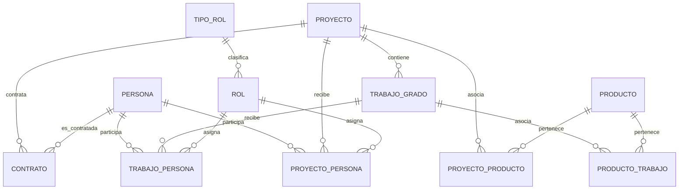

# Documentacion de Base de Datos (PostgreSQL)

## 1) Esquema y fuente de verdad
- Motor: PostgreSQL 16
- Esquema principal: `proyecto`
- Script de definicion: `init/001_schema.sql`
- Script de seeds: `init/002_seed.sql`

El backend usa `search_path=proyecto` en la conexion SQLAlchemy.

## 2) Entidades principales
Catalogos:
- `tipo_rol`
- `rol`
- `producto`

Nucleo:
- `persona`
- `proyecto`
- `trabajo_grado`
- `contrato`

Relaciones:
- `proyecto_persona`
- `trabajo_persona`
- `proyecto_producto`
- `producto_trabajo`

## 3) Relaciones de negocio
- Un `tipo_rol` tiene muchos `rol`.
- Una `persona` puede participar en varios `proyecto` (tabla `proyecto_persona`).
- Un `trabajo_grado` pertenece a un `proyecto`.
- Una `persona` puede participar en varios `trabajo_grado` (tabla `trabajo_persona`).
- Un `proyecto` puede asociar varios `producto` (tabla `proyecto_producto`).
- Un `trabajo_grado` puede asociar varios `producto` (tabla `producto_trabajo`).
- `contrato` relaciona `proyecto` con `persona`.

## 4) Diagrama logico simplificado


## 5) Seeds y datos de prueba
Datos iniciales cargados en `init/002_seed.sql`:
- 2 tipos de rol
- 2 roles
- 2 personas
- 1 proyecto
- 1 trabajo de grado
- 1 producto
- Relaciones iniciales de proyecto/trabajo/producto
- 2 contratos

Usuario admin incluido en seeds:
- usuario: `admin`
- clave: `Admin123!`

## 6) Reset de base de datos
Para eliminar volumen y reconstruir schema + seeds desde cero:
```bash
docker compose down -v
docker compose up -d --build
```

Esto recrea el contenedor de PostgreSQL y vuelve a ejecutar scripts de `init/`.

## 7) Ejecucion desde cero (pasos recomendados)
1. Clonar repositorio.
2. Ejecutar `docker compose up -d --build`.
3. Verificar salud en `http://localhost:8000/health`.
4. Probar login con admin por defecto.
5. Acceder frontend en `http://localhost:8080`.

## 8) Pendientes de base de datos
- Actualmente no hay migraciones versionadas (Alembic).
- No se registran constraints de unicidad adicionales para evitar duplicados en algunas tablas de relacion (se puede endurecer en una siguiente iteracion).
